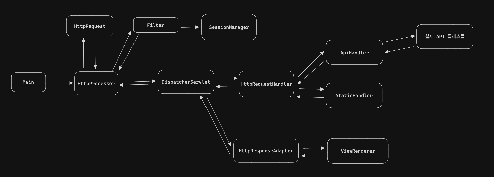

# Java WAS

2024 우아한 테크캠프 프로젝트 WAS

## 구조 그림 및 설명

### HttpProcessor

- Http 과정을 진행하는 클래스로 실제 한 쓰레드가 진행하는 단위이다.
- HttpRequest로 입력 받은 버퍼를 보내서 파싱된 결과를 객체로 받는다.
- 필터를 통해 권한이 필요한 api, 정적 리소스에 접근하는지 확인한다.
- DispatcherServlet을 호출해 로직을 실행한다.
- DispatcherServlet의 리턴 값인 HttpResponse를 출력 스트림에 적고 끝낸다.

### HttpRequest

- 입력 메시지를 HttpRequest 메시지로 파싱하는 객체이다.
- startLine, headers, body 세 가지로 나누어서 각각의 객체로 파싱해 멤버 변수로 가지고 있다.

### Filter

- 파싱된 Request를 바탕으로 필터링을 진행한다.
- 현재는 로그인 유무로 권한이 필요한 api 및 static 파일 접근을 막는 로그인 필터가 있다.
- SessionManager로 로그인에 대한 세션을 관리하고 확인한다.

### DispatcherServlet

- 들어온 요청을 실질적으로 처리하는 객체
- HttpRequestHandler를 통해 반환된 객체를 HttpResponseAdapter를 통해 HttpResponse로 반환하는 과정을 담당한다.

### HttpRequestHandler

- 들어온 요청을 Api와 Static 중에 지원 가능한걸 판단해서 해당 handler로 보낸다.
- Api는 어노테이션으로 구분, 리플렉션 invoke로 실제 API 로직을 호출한다. 리턴 값은 아무거나 반환이 되고, 매개변수는 HttpRequest이다.
- static은 css 및 각종 이미지 파일을 처리하는 handler이다.

### HttpResponseAdapter

- Object로 반환된 Handler 다양한 인스턴스 타입 결과를 로직을 통해 HttpResponse로 반환해준다.
- 현재는 TemplateAdapter가 존재하며 ModelAndView를 반환한 Handler 결과에 대해 일련의 가공 후에 HttpResponse로 반환해준다.

### ViewRenderer

- html을 동적으로 만들어주는 책임을 갖는 인터페이스로, ModelAndView의 값을 이용하여 요청을 바탕으로 동적으로 html을 만들어준다.
